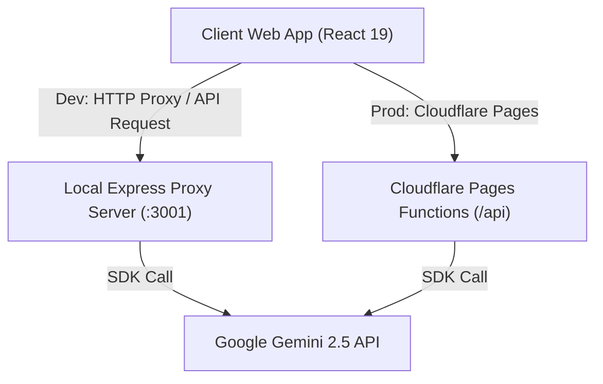

<div align="center">

# 🎓 Adaptiva Study

**AI-Powered Adaptive Learning Companion**

An intelligent, interactive learning platform that generates tailored curriculums, interactive lessons, smart flashcards, and quizzes powered by Google Gemini AI.

[](https://bun.sh)
[](https://react.dev)
[](https://www.typescriptlang.org/)
[](https://vitejs.dev/)
[](https://expressjs.com/)
[](https://pages.cloudflare.com/)
[](https://ai.google.dev/)
[](https://vitest.dev/)

[Features](#-features) • [Architecture](#-architecture) • [Getting Started](#-getting-started) • [Environment Variables](#-environment-variables) • [Scripts](#-available-scripts) • [Deployment](#-deployment)

</div>

---

## ✨ Features

- 🧠 **Adaptive Curriculum Generation**: Input any subject or topic to instantly generate structured, multi-module learning paths customized to your current skill level.
- 💬 **Interactive AI Tutor**: Context-aware AI assistant powered by Google Gemini for step-by-step guidance, deep-dive explanations, and Q&A.
- 📝 **Smart Quizzes & Flashcards**: Auto-generated practice quizzes, flashcards, and instant feedback to test and reinforce comprehension.
- 📐 **Rich Math & Content Formatting**: Native support for LaTeX mathematical expressions via KaTeX, dynamic Markdown rendering, and sanitized output using DOMPurify.
- 🔒 **Secure API Architecture**: Dual backend support using Express proxy locally and Cloudflare Pages Functions in production to keep Gemini API credentials safe.
- ⚡ **Bun Monorepo**: High-performance development workflow leveraging Bun workspaces for seamless dependency management and instant startup.

---

## 🏗 Architecture

Adaptiva is structured as a **Bun workspaces monorepo**:

```
adaptiva/
├── apps/
│   ├── web/            # Frontend SPA (React 19 + Vite 6 + KaTeX + CSS)
│   └── api/            # Local Express proxy server (hides Gemini API key)
├── packages/
│   └── shared/         # Shared TypeScript interfaces, types, and domain helpers
├── functions/
│   └── api/            # Cloudflare Pages Functions (Edge API proxy for production)
├── scripts/            # Deployment & Cloudflare KV setup utilities
├── wrangler.jsonc      # Cloudflare Pages configuration & KV bindings
├── package.json        # Workspace root configuration
└── tsconfig.base.json  # Shared TypeScript configuration
```

### Data Flow



---

## 🚀 Getting Started

### Prerequisites

- **[Bun](https://bun.sh)** `>= 1.2`
- **Google Gemini API Key** (Get one at [Google AI Studio](https://aistudio.google.com/))

### Installation

1. **Clone the repository**:
   ```bash
   git clone https://github.com/your-username/adaptiva.git
   cd adaptiva
   ```

2. **Install dependencies**:
   ```bash
   bun install
   ```

3. **Configure Environment Variables**:
   Copy `.env.example` or create a `.env.local` file at the monorepo root:
   ```bash
   cp .env.example .env.local
   ```
   Add your Gemini API key:
   ```env
   GEMINI_API_KEY=your_actual_gemini_api_key_here
   ```

4. **Run Development Servers**:
   Start both the frontend web app and backend proxy concurrently:
   ```bash
   bun run dev
   ```
   - **Web UI**: http://localhost:3000
   - **API Proxy**: http://localhost:3001

   *To run services individually:*
   ```bash
   bun run dev:web   # Launches Vite dev server only
   bun run dev:api   # Launches Express server only
   ```

---

## ⚙️ Environment Variables

| Variable | Scope | Description | Required |
| :--- | :--- | :--- | :---: |
| `GEMINI_API_KEY` | Monorepo / Cloudflare Pages | API Key for Google Gemini services | Yes |
| `PORT` | `apps/api` | Port for the Express backend proxy (Default: `3001`) | No |
| `CLOUDFLARE_API_TOKEN` | Deployment Scripts | API token for Cloudflare Pages deployment | For Deploy |
| `CLOUDFLARE_ACCOUNT_ID` | Deployment Scripts | Cloudflare account ID | For Deploy |

---

## 🛠 Available Scripts

All commands can be executed from the monorepo root using `bun`:

| Command | Action |
| :--- | :--- |
| `bun run dev` | Runs web frontend and API proxy concurrently |
| `bun run dev:web` | Runs frontend Vite dev server (`http://localhost:3000`) |
| `bun run dev:api` | Runs local Express proxy server (`http://localhost:3001`) |
| `bun run build` | Builds static assets for production into `apps/web/dist` |
| `bun run start` | Serves production web build via API proxy |
| `bun run test` | Runs frontend Vitest unit test suite |
| `bun run deploy` | Deploys web app and edge functions to Cloudflare Pages |
| `bun run check:cf` | Verifies Cloudflare deployment status and API health |
| `bun run setup:kv` | Initializes Cloudflare KV namespaces for sessions |

---

## 🌐 Deployment

Adaptiva is optimized for deployment on **Cloudflare Pages**.

1. **Set Cloudflare Secrets**:
   Upload your Gemini API key to Cloudflare Pages:
   ```bash
   bun run pages:secret:set
   ```

2. **Deploy to Cloudflare Pages**:
   Run the deployment script:
   ```bash
   bun run deploy
   ```
   Or perform a dry-run test build:
   ```bash
   bun run deploy:dry
   ```

---

## 🧪 Testing

The codebase includes test suites powered by **Vitest** and **React Testing Library**.

To execute tests and verify functionality:
```bash
bun run test
```

---

## 📄 License

This project is licensed under the [MIT License](LICENSE).
